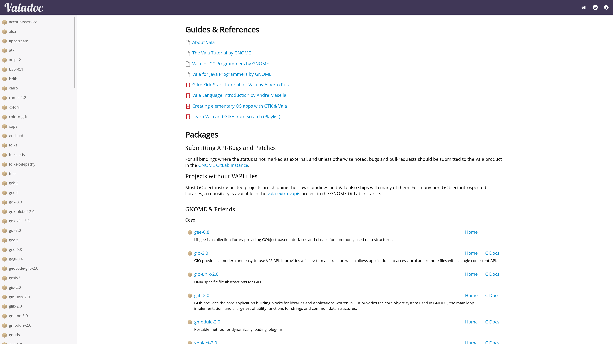
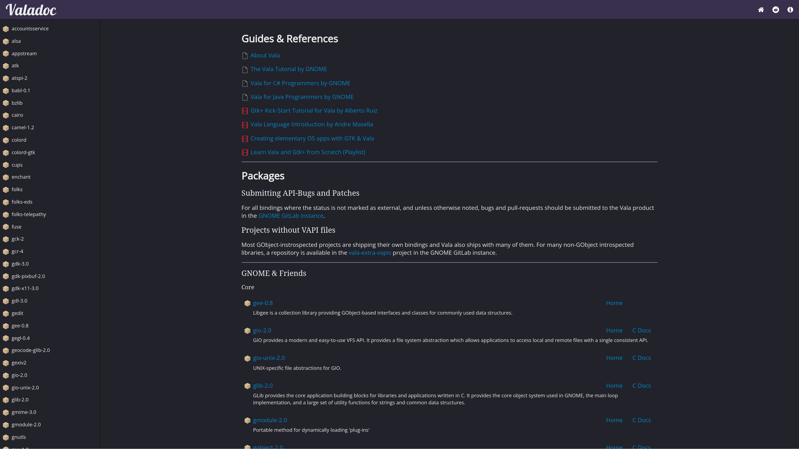

# valadoc-www - A Valadoc.org spinoff

Learn Vala, do future.

This project generates a version of the valadoc.org website that is statically generated.

The goal is for people to easily have a local copy of valadoc.org,
that can also be statically hosted and can easily be experimented on.

You can view the output of a `core` preset build here: https://colinkiama.github.io/valadoc-www/

## Screenshots





## Build Instructions

In order to build the docs you will need the following:

- `valadoc` >= 0.35.0
- Node.js (LTS Version) - We recommend using [nvm](https://github.com/nvm-sh/nvm) or [nvm-windows](https://github.com/coreybutler/nvm-windows) for easily managing different node versions.
- 4 GB of free space

On elementary OS or Ubuntu run:

```bash
sudo add-apt-repository ppa:vala-team
sudo apt update
sudo apt install meson ninja-build valac valadoc libvaladoc-dev libtemplate-glib-1.0-dev unzip
```

Arch or derivatives run:

```bash
pacman -S meson ninja vala template-glib
```

Next, install JS dependencies:

After you have `valadoc` installed, you can move to building the documentation.

First make sure that you are currently the root of the project.

Also, there's a chance that these build scripts may not be have permissions to run at first. Run the following command to give the build scripts executable permissions so that they can run on your machine:

```sh
chmod +x ./task/*
```

Now, to build the programs and assets needed to generated the website run this command:

```sh
./task/build
```

Now run this command to generate the website:

```sh
./task/run
```

By default, these commands will generate documentation for all packages.

This may take a while since it's generating documentation for a lot of packages.
If you aren't planning on generating documentation for all packages in valadoc.org
then I suggest [tyring out some configuration options](#configuration-options).

The generated website will be available in a directory called `valadoc.org`.
You can open up the `index.html` file in a web browser to start browsing the documentation.

If you're planning on serving the website on a HTTP server (or you want to use a dev server), feel free to use the `BASE_URL` environment variable.

This will help you avoid asset loading issues with stylesheets and scripts in
when the site is hosted on a subpath e.g when you host the site on GitHub Pages.

## Development Commands

Build:

```sh
./task/build
```

Run generator:

```sh
./task/run
```

Clean Project:

```sh
./task/clean
```

## Configuration Options

### Environment Variables

You can override which Vala compiler you want to use by setting the `VALAC`
environment variable when running the `task/build` commands. Meson is aware
of it.

There are also plenty of ways to customise the behaviour of the site generator.
Check out the top of the `task/build` and `task/run` files for environment variables that you can set to change the behaviour to your liking.

Two more important options to note are these variables that affect the `task/build` script.

`DISABLE_GIRS_REPO` and `DISABLE_EXTRA_VAPIS_REPO`. By setting them to `true` (or any other value that isn't `false` or an empty string), the `task/build` script skips the steps of cloning each respective Git repository. This helps you save a lot of space and time, especially when you disable the `vala-girs` with the `DISABLE_GIRS_REPO` option (it takes up 200MB worth of disk space).

Warning: Due to the way meson works, if you set some of these variables, the options
are saved, even if you run the `task/build` command again with no environment variables the next time. In cases where you just want the default behaviour to happen, it's recommended to either:

- Delete the `build` directory
- Run the `task/clean` script

### Presets

By default, documentation is generated for all packages. However, you can customise
which packages get generated using the `PACKAGES` variable. This can get quite tedious so there is also a `PRESET` variable
that can select a range of packages for you. Here is what you can use:

| Value      | Description                                                              |
| ---------- | ------------------------------------------------------------------------ |
| core       | Core GNOME packages, `posix` and `linux` packages                        |
| gtk4       | A variety of packages to help you make GUI Applications powered by GTK 4 |
| elementary | An extension of the `gtk4` preset with elementary OS specific packages   |

## Add New Packages

Open `documentation/packages.xml` and add a new package-entry.

Use `<external-package>` to create external links:

```xml
<external-package name="package-name" link="http://path/to/docs">
  short description
</external-package>
```

Use `<package>` to build and include documentation for vapi files:

```xml
<package name="gdl-1.0">
  short description
</package>
```

The following attributes are supported:

| Name              | Description                                        |
| ----------------- | -------------------------------------------------- |
| name              | The vapi name                                      |
| deprecated        | Set it to '"true"' to mark a package as deprecated |
| maintainers       | List of binding maintainers                        |
| gir               | The GIR file used to extract documentation from    |
| c-docs            | Link to C documentation                            |
| ignore            | Do not build documentation for this entry          |
| home              | Homepage link                                      |
| flags             | Additional vala flags (Missing dependencies, ...)  |
| gallery           | Link to a GTK-Doc widget gallery                   |
| vapi-image-source | Source to download images from                     |

Referenced GIR and vapi-files have to be part of one of the following repositories:

- [vala](http://vala-project.org/)
- [vala-girs](https://github.com/nemequ/vala-girs)
- [vala-extra-vapis](https://gitlab.gnome.org/GNOME/vala-extra-vapis)

## Add New Source Code Examples

Copy your examples to `examples/<vapi-name>/` and add a new entry to `examples/<vapi-name>/<vapi-name>.valadoc.examples`:

```xml
<example>
  <title>Example Title</title>
  <image>optional-screenshot.png</image>
  <file>file-name-1.vala</file>
  <file>file-name-2.vala</file>
  <compile>valac file-name1.vala file-name-2.vala ...</compile>
  <node>Associated.Symbol.name1</node>
  <node>Associated.Symbol.name2</node>
</example>
```

If this is the first example for the package, add a line to the `examples.txt`.

## Add Handwritten Documentation

Create a new file called `<vapi-name>.valadoc` in `documentation/<vapi-name>/`:

```
...

/**
 * My valadoc comment
 */
c::c_symbol_name
```

```
...

/**
 * My valadoc comment
 */
Vala.Symbol.Name
```

## Tool Overview

- _build/generator:_ Parses `packages.xml` files describing all packages. It is responsible for building
  up the page. It fetches resources such as images from specified sources, computes valadoc-calls,
  builds documentation for specified packages and puts-together the whole page. (`task/run`)
- _build/valadoc-example-gen:_ Internally used to generate example listings.
- _build/valadoc-example-tester:_ Compiles and checks all registered examples. (`task/test_examples`)

## Common Pitfalls

`error: failed to load driver`

- Your valadoc version does not support the requested vala version. Install a recent vala version and
  recompile valadoc.
- Change `VALAC_VERSION` in `task/build` and/or `task/run`.

Other errors:

- Check `LOG` in the root of this repo for more information
- Have you run out of disk space?

## Contact And Help

- [Git Repository](https://github.com/colinkiama/valadoc-www)
- [Issue Tracker, valadoc-www](https://github.com/colinkiama/valadoc-www/issues)
- [Issue Tracker, valadoc (now a part of Vala)](https://gitlab.gnome.org/GNOME/vala/issues)
- Matrix: <https://matrix.to/#/#vala:gnome.org> (#vala:gnome.org)
- Mail: [colinkiama@gmail.com](mailto:colinkiama@gmail.com)
